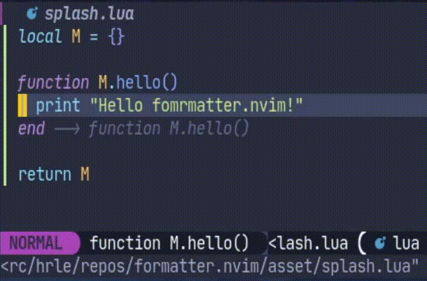

# Formatter.nvim

<div align="center">
  <h3>A format runner for <code>Neovim</code>.</h3>
  
</div>

We want to thank the [`neoformat`](https://github.com/sbdchd/neoformat)
contributors. They developed a lot of formatter configurations that we used as
a reference to create our own opt-in default formatter configurations.

## Features

- Written in `Lua`
- Asynchronous execution
- Buffer locking
- Opt-in default formatter configurations
- Conditional formatting
- Before/after format hooks

## Install

With [`packer.nvim`](https://github.com/wbthomason/packer.nvim):

```lua
require('packer').use { 'mhartington/formatter.nvim' }
```

With [`paq-nvim`](https://github.com/savq/paq-nvim):

```lua
require("paq") { 'mhartington/formatter.nvim' }
```

With [`vim-plug`](https://github.com/junegunn/vim-plug):

```vim
Plug 'mhartington/formatter.nvim'
```

With [`Vundle.vim`](https://github.com/VundleVim/Vundle.vim):

```vim
Plugin 'mhartington/formatter.nvim'
```

With [`vim-pathogen`](https://github.com/tpope/vim-pathogen):

```shell
cd ~/.vim/bundle && \
git clone https://github.com/mhartington/formatter.nvim
```

With [`dein.vim`](https://github.com/Shougo/dein.vim):

```vim
call dein#add('mhartington/formatter.nvim')
```

## Configure

Setup:

```lua
-- Utilities for creating configurations
local util = require "formatter.util"

-- Provides the Format, FormatWrite, FormatLock, and FormatWriteLock commands
require("formatter").setup {
  -- Enable or disable logging
  logging = true,
  -- Set the log level
  log_level = vim.log.levels.WARN,
  -- All formatter configurations are opt-in
  filetype = {
    -- Example for web devs, can just make everything prettier!
    -- refers to the 'formatter' folder which just lists tools, like prettier here
    -- https://github.com/mhartington/formatter.nvim/blob/master/lua/formatter/defaults/prettier.lua
    javascriptreact = { require 'formatter.defaults.prettier' },
    javascript = { require 'formatter.defaults.prettier' },
    typescriptreact = { require 'formatter.defaults.prettier' },
    typescript = { require 'formatter.defaults.prettier' },
    json = { require 'formatter.defaults.prettier' },
    markdown = { require 'formatter.defaults.prettier' },
    html = { require 'formatter.defaults.prettier' },
    css = { require 'formatter.defaults.prettier' },

    -- Format rust using rustfmt
    -- refers to the 'filetypes' folder here
    -- https://github.com/mhartington/formatter.nvim/blob/master/lua/formatter/filetypes/rust.lua
    rust = { require('formatter.filetypes.rust').rustfmt },

    -- Advanced formatter configurations for filetype "lua" -- will be executed in order
    lua = {
      -- Format lua using stylua
      -- refers to the 'filetypes' folder here
      -- https://github.com/mhartington/formatter.nvim/blob/master/lua/formatter/filetypes/lua.lua
      require("formatter.filetypes.lua").stylua,

      -- You can also define your own configuration
      function()
        -- Supports conditional formatting
        if util.get_current_buffer_file_name() == "special.lua" then
          return nil
        end

        -- Full specification of configurations is down below and in Vim help
        -- files
        return {
          exe = "stylua",
          args = {
            "--search-parent-directories",
            "--stdin-filepath",
            util.escape_path(util.get_current_buffer_file_path()),
            "--",
            "-",
          },
          stdin = true,
        }
      end
    },

    -- Use the special "*" filetype for defining formatter configurations on
    -- any filetype
    ["*"] = {
      -- "formatter.filetypes.any" defines default configurations for any
      -- filetype
      require("formatter.filetypes.any").remove_trailing_whitespace
    }
  }
}
```

### Opt-in formatters

By default, there are no preconfigured formatters. You can opt-into
[default configurations per formatter](lua/formatter/defaults),
[default configurations per `filetype`](lua/formatter/filetypes), and
[default configurations for any `filetype`](lua/formatter/filetypes/any.lua)
or write your own. It is hard to predict what everyone wants, but
at the same time we realize that most formatter configurations are the same.
See the discussion in
[#97](https://github.com/mhartington/formatter.nvim/issues/97) for more
information.

You can use the
[default configurations per formatter](lua/formatter/defaults),
[default configurations per `filetype`](lua/formatter/filetypes), and
[default configurations for any `filetype`](lua/formatter/filetypes/any.lua)
as a starting point for creating your configurations.
Feel free to contribute to this repository by creating or improving default
configurations that everyone can use! The guide for contributing to default
configurations is below.

You can use the [`util` module](lua/formatter/util.lua) which has various
functions that help with creating default configurations as shown above.

### Map keys

```vim
nnoremap <silent> <leader>f :Format<CR>
nnoremap <silent> <leader>F :FormatWrite<CR>
```

### Format after save

```vim
augroup FormatAutogroup
  autocmd!
  autocmd BufWritePost * FormatWrite
augroup END
```

### Before/after format hooks

You can execute code before and after formatting like so:

```vim
augroup FormatAutogroup
  autocmd!
  autocmd User FormatterPre lua print "This will print before formatting"
  autocmd User FormatterPost lua print "This will print after formatting"
augroup END
```

Note that these commands are executed using `silent` when the `log_level`
is higher than `vim.log.levels.DEBUG`.

### Buffer locking

Use the `FormatLock` and `FormatWriteLock` commands instead of `Format` and
`FormatWrite` to lock the buffer (set buffer option `modifiable` to false)
while formatting.

### Configuration specification

Each formatter configuration is a function that returns a table. Because
each entry is a function, the tables for each `filetype` act as an ordered list
(or array). This means things run in the order you list them, keep this
in mind. You can also return `nil` from these functions to conditionally apply
formatters.

Each formatter configuration should return a table that consist of:

- `exe`: the program you wish to run.
- `args`: a table of arguments to pass (optional)
- `stdin`: if it should use the standard input (optional)
- `cwd` : the path to run the program from (optional)
- `try_node_modules`: tries to run a formatter from locally install npm
  packages (optional) (to be implemented)
- `no_append` : don't append the path of the file to the formatter command
  (optional)
- `ignore_exitcode` : set to true if the program expects non-zero success exit
  code (optional)
- `transform` : pass a function that takes in the formatted text and returns
  the text to be applied to the buffer (optional) (see
  [`ruby` `rubocop`](lua/formatter/filetypes/ruby) default formatter
  configuration as an example)
- `tempfile_dir`: directory for temp file when not using `stdin` (optional)
- `tempfile_prefix`: prefix for temp file when not using `stdin` (optional)
- `tempfile_postfix`: postfix for temp file when not using `stdin` (optional)

#### `cwd`

The `cwd` argument can be used for in example monolithic projects which contain
sources with different styles. Setting `cwd` to the path of the file being
formatted causes, for example, `clang-format` to search for the nearest
`.clang-format` file in the file's parent directories.

#### `try_node_modules`

The `try_node_modules` argument is not yet implemented, but feel free to use
this argument in your configurations. When we add support for it, you get
the `node_modules` package scanning functionality automatically!

#### `no_append`

The `no_append` argument is important for formatters that don't take the path
to the formatted file as the last argument. A small minority of formatters take
the path to the formatted file as a named argument. For an example, check the
[default `javascript` `prettydiff` configuration](lua/formatter/filetypes/javascript.lua).

## Contribute

Refer to the [CONTRIBUTING.md](CONTRIBUTING.md) file for more information.
